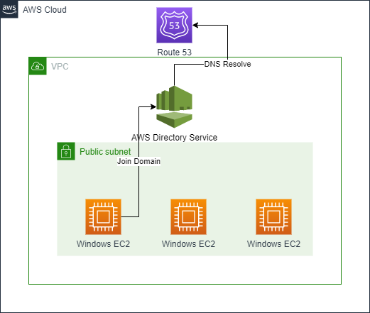
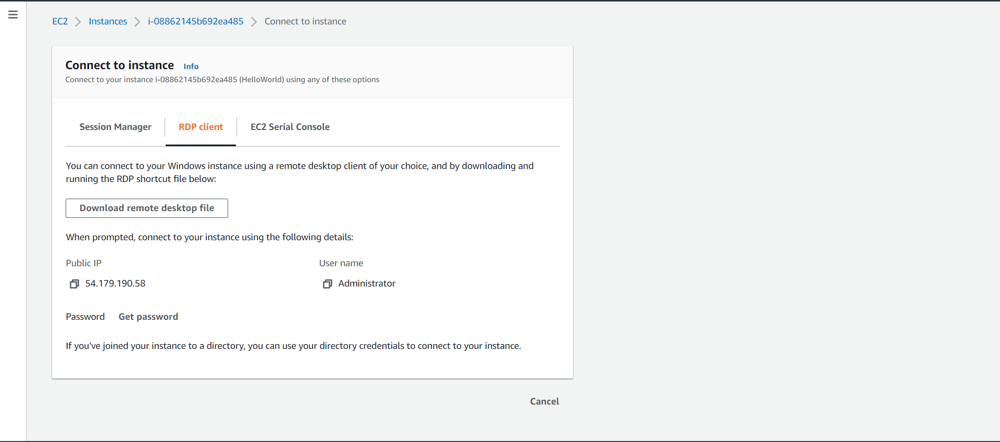
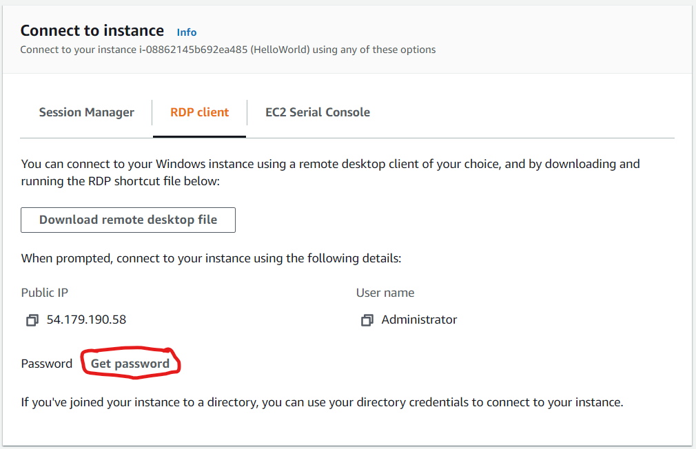
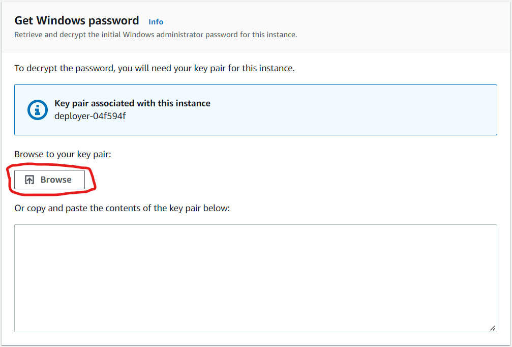
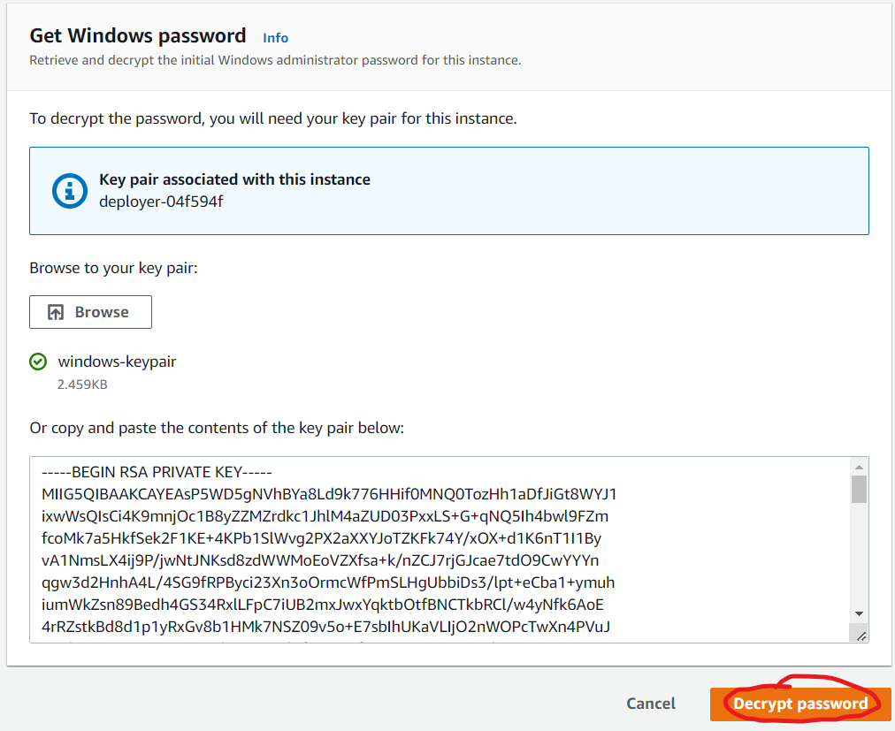
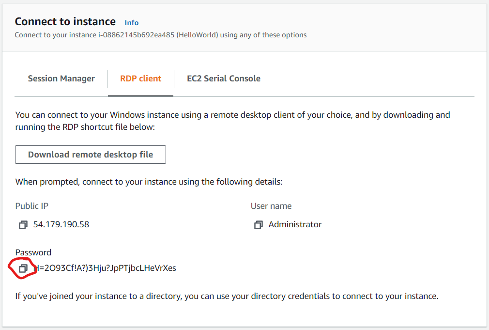
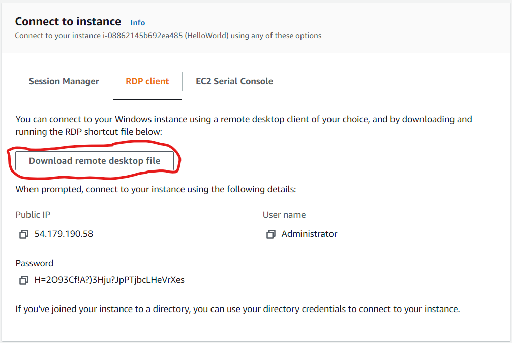
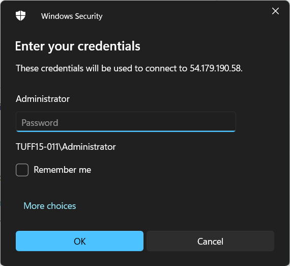
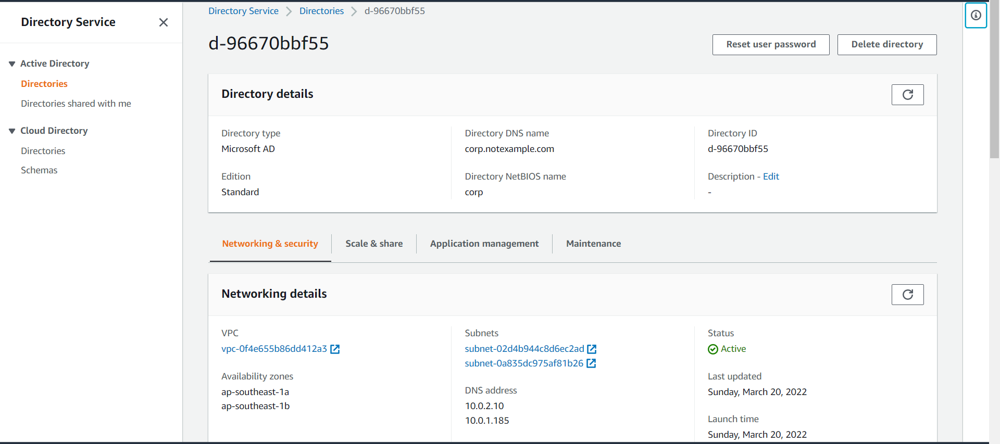
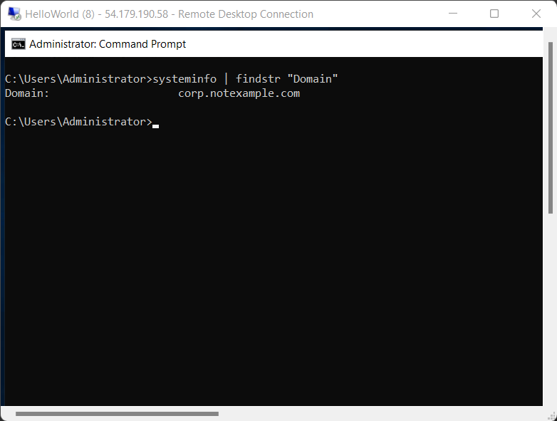

# **Windows Dev Environment**
> Windows Development Environment with AWS Active Directory Service and EC2 Windows Auto Join Domain
### **Diagram**

### **Requirement**
1. [AWS CLI installed](https://docs.aws.amazon.com/cli/latest/userguide/getting-started-install.html)
2. [Configure AWS CLI](https://docs.aws.amazon.com/cli/latest/userguide/cli-configure-quickstart.html#cli-configure-quickstart-config)
3. [Pulumi installed](https://www.pulumi.com/docs/get-started/install/)
4. [Pulumi logged in](https://www.pulumi.com/docs/reference/cli/pulumi_login/)
### **How To**
1. Clone repository
```
git clone https://github.com/ludesdeveloper/windows-active-directory-dev-env.git
```
2. Change directory
```
cd windows-active-directory-dev-env
```
3. Install the required Node.js packages
```
npm install
```
4. Create a new stack, which is an isolated deployment target for this example
```
pulumi stack init
```
5. Set the required configuration variables for this program
```
pulumi config set aws:region ap-southeast-1
```
6. Change directory to script
```
cd script
```
7. Generate keypair
```
ssh-keygen -m PEM -f windows-keypair
```
8. Change directory to root folder
```
cd ..
```
8. Create our infrastructure
```
pulumi up --yes
```
### **Accessing Windows EC2**
1. Connect to your windows, choose RDP Client

2. Click get password

3. Click browse

4. Click decrypt

5. Copy your password

6. Download your rdp file

7. Open your rdp file, and paste your password

### **Screenshot Result**
1. Directory Service

2. Join Domain Result
```
systeminfo | findstr "Domain"
```

###**Housekeeping**
1. Destroy your infrastructure
```
pulumi destroy --yes
```